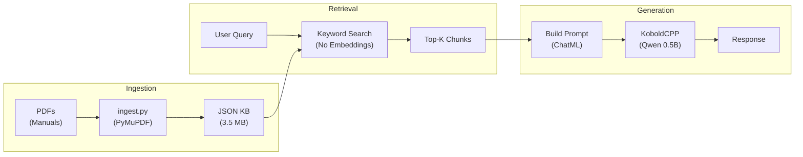

# MANTIS - Manual Assisted Navigation Technical Info System

*Field Manual RAG By Scratch System for Constraints-Based Hardware*

A lightweight, offline Retrieval-Augmented Generation system designed for aviation maintenance manuals. Optimized for No GPU/Legacy/Embedded hardware.

> ⚠️ **DISCLAIMER:** All sample manuals included in this project are **Distribution Statement A: Approved for public release; distribution is unlimited.** Ensure compliance with applicable regulations when adding additional technical documentation.

## Download Required Files

### Option A: Automated
```powershell
.\setup.bat
```

### Option B: Manual
```powershell
# KoboldCPP No-AVX build (~410 MB)
curl -L -o "server.exe" "https://github.com/LostRuins/koboldcpp/releases/download/v1.107/koboldcpp-oldpc.exe"

# Qwen 2.5 0.5B Q4_K_M (~463 MB) - OR use any model of your choice
curl -L -o "qwen2.5-0.5b-instruct-q4_k_m.gguf" "https://huggingface.co/Qwen/Qwen2.5-0.5B-Instruct-GGUF/resolve/main/qwen2.5-0.5b-instruct-q4_k_m.gguf"
```

---

## Quick Start

```powershell
# 1. Install requirements
pip install -r requirements.txt

# 2. Injest PDFs
python src/ingest.py

# 3. Start LLM server (separate terminal) [Set threads accordingly to the CPU]
.\server.exe --model qwen2.5-0.5b-instruct-q4_k_m.gguf --port 5001 --threads 4

# 4. Launch CLI chat (in separate terminal)
python src/main.py
```

---

## How It Works



---

## Sample Knowledge Base

| Platform | Type | Chunks | Source Documents |
|----------|------|--------|------------------|
| RC-12    | Reconnaissance Plane | 1,327  | 6 manuals        |
| AH-1     | Attack Helicopter | 505    | 2 manuals        |
| C-12     | Utility Plane | 342    | 2 manuals        |
| UH-1     | Utility Helicopter | 184    | 1 manual         |
| RD-12    | Reconnaissance Plane | 164    | 1 manual         |
| OH-58    | Observation Helicopter | 122    | 1 manual         |
| **Total**| | **2,644** | **12 PDFs**   |

---

## Adding New Manuals

1. Drop PDF files into the `Manuals/` folder
2. (Optional) Add platform pattern to `ingest.py` if needed:
   ```python
   PLATFORM_PATTERNS = {
       # ... existing patterns ...
       "NEW-PLATFORM": re.compile(r"pattern", re.IGNORECASE),
   }
   ```
3. Re-run: `python ingest.py`

---

## Project Structure

```
MANTIS/
├── src/
│   ├── ingest.py           # PDF → JSON indexer
│   └── main.py             # CLI RAG interface
├── data/
│   └── knowledge_base.json # Indexed chunks (generated)
├── Manuals/                # Source PDFs
├── server.exe              # KoboldCPP (No-AVX)
├── *.gguf                  # Quantized LLM
└── setup.bat               # Auto-downloader
```

---

## Requirements

- Python 3.8+ (3.6+ may work)
- `pymupdf` — PDF text extraction
- `requests` — Offline API calls to KoboldCPP

---

## Troubleshooting

### "Cannot connect to KoboldCPP server"
- Make sure `server.exe` is running in a separate terminal
- Check that port is not blocked by firewall
- Run `/status` command to verify connection

### "Knowledge base not found"
- Run `python ingest.py` first to build the index
- Ensure `Manuals/` folder contains PDF files

### Slow responses
- Reduce `max_length` in `main.py` for faster responses
- Close other applications to free RAM

### Missing platform tags
- Add new patterns to `PLATFORM_PATTERNS` in `ingest.py`
- Re-run `python ingest.py` to rebuild the index

---

## License

MIT
