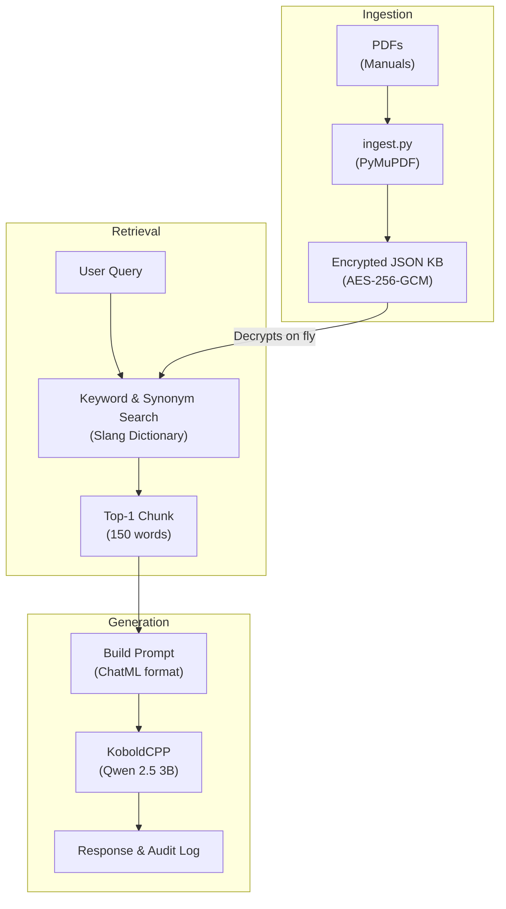

# MANTIS - Manual Assisted Navigation Technical Info System

*Field Manual RAG By Scratch System for Constraints-Based Hardware*

A lightweight, offline Retrieval-Augmented Generation system designed for aviation maintenance manuals. Optimized for No GPU/Legacy/Embedded hardware (such as IBM ThinkPads/Panasonic Toughbooks).

> **DISCLAIMER:** All sample manuals included in this project are **Distribution Statement A: Approved for public release; distribution is unlimited.** Ensure compliance with applicable regulations when adding additional technical documentation.

---

## Key Features

*   **Ultra-Lightweight RAG**: Runs entirely on the CPU with zero external API dependencies. 
*   **Qwen 2.5 3B Power**: Utilizes the highly capable `Qwen-2.5-3B-Instruct` model quantized to 4-bit (`Q4_K_M`) to perfectly balance reading comprehension and memory footprint (~2.2 GB RAM).
*   **Encrypted Knowledge Base**: The JSON vector-less index is fully encrypted at rest using **AES-256-GCM** to protect sensitive technical documentation.
*   **Sliding Window Chunking**: Manuals are ingested using a highly targeted 150-word sliding window (with 50-word overlap) to ensure the LLM never suffers from "lost in the middle" syndrome.
*   **Auto-Server Management**: The RAG interface automatically spins up and shuts down the background LLM inference server. No dual-terminal juggling required.
*   **Audit Logging**: Every interaction, retrieved chunk, and AI response is securely logged for maintenance oversight.

---

## Installation & Setup

### Option A: Automated (Recommended)
```powershell
.\setup.bat
```
*(This will automatically download the 435MB `server.exe` inference engine and the 2.2GB Qwen 2.5 3B model file).*

### Option B: Manual
```powershell
# KoboldCPP No-AVX build
curl -L -o "server.exe" "https://github.com/LostRuins/koboldcpp/releases/download/v1.114.1/koboldcpp-oldpc.exe"

# Qwen 2.5 3B Instruct Q4_K_M
curl -L -o "qwen2.5-3b-instruct-q4_k_m.gguf" "https://huggingface.co/Qwen/Qwen2.5-3B-Instruct-GGUF/resolve/main/qwen2.5-3b-instruct-q4_k_m.gguf?download=true"
```

---

## Quick Start

```powershell
# 1. Install requirements
pip install -r requirements.txt

# 2. Ingest & Encrypt PDFs (Only needed when adding new manuals)
python src/ingest.py

# 3. Launch the RAG Chat Interface
python src/main.py
```
*Note: `main.py` will automatically detect the `.gguf` file, start the background server, wait for it to boot, and present the chat interface.*

---

## Architecture


```mermaid
flowchart TD
    subgraph Ingestion
        A["PDFs<br/>(Manuals)"] --> B["ingest.py<br/>(PyMuPDF)"]
        B --> C["Encrypted JSON KB<br/>(AES-256-GCM)"]
    end
    
    subgraph Retrieval
        D["User Query"] --> E["Keyword & Synonym Search<br/>(Slang Dictionary)"]
        C -- Decrypts on fly --> E
        E --> F["Top-1 Chunk<br/>(150 words)"]
    end
    
    subgraph Generation
        F --> G["Build Prompt<br/>(ChatML format)"]
        G --> H["KoboldCPP<br/>(Qwen 2.5 3B)"]
        H --> I["Response & Audit Log"]
    end
```

---

## Current Knowledge Base

| Platform | Type | Chunks |
|----------|------|--------|
| RC-12    | Reconnaissance Plane | 3,191  |
| AH-1     | Attack Helicopter | 1,093  |
| C-12     | Utility Plane | 506    |
| RD-12    | Reconnaissance Plane | 224    |
| UH-1     | Utility Helicopter | 210    |
| OH-58    | Observation Helicopter | 175    |
| **Total**| | **5,399** |

---

## Project Structure

```text
MANTIS/
├── src/
│   ├── ingest.py           # PDF parser, chunker, & indexer
│   ├── main.py             # CLI RAG interface & server manager
│   ├── security.py         # AES-256-GCM encryption handler
│   └── audit_logger.py     # Session interaction logger
├── tests/                  # Unittest suite (70+ tests)
├── data/
│   └── knowledge_base.json # Encrypted index (generated)
├── logs/
│   └── audit.log           # Interaction history (generated)
├── Manuals/                # Source PDFs
├── server.exe              # KoboldCPP inference engine
├── *.gguf                  # Quantized Qwen 2.5 3B model
└── setup.bat               # Auto-downloader script
```

---

## Troubleshooting

### "Cannot connect to KoboldCPP server"
- Ensure `server.exe` was successfully downloaded.
- Ensure the `.gguf` model file is located in the root MANTIS directory.
- Run `/status` in the CLI to check connection status.

### Missing platform tags
- If querying a new aircraft, add its pattern to `PLATFORM_PATTERNS` in `src/ingest.py` and re-run ingestion.

---

## License

MIT
